># Revenue Recognition with Transaction Script

This spring boot application is for revenue recognition where, users should be able to (1) add contract which would insert revenue recognition, (2) calculate recognized revenue as of some date

I have created this application with two approaches 

1) Transaction Script with Table Data Gateway

2) [Domain Model with JPA](https://github.com/shubhanginigon/HW/tree/main/HW4%20-%20Domain%20Logic%20and%20Data%20Source/RevenueRecognitionDomainModel)

>### Prerequisites

> Create the spring boot project with following dependencies:

1) Lombok - for reducing boilerplate code

2) JDBC API - api for database interaction

3) H2 - in-memory database (feel free to use others)

4) Spring Web - provides controllers and MVC support

> Also add following dependencies from [Maven Repository](https://mvnrepository.com/)

1) Money-api and moneta - for working with currency file

2) Tomcat jasper - for working with jsp file

3) Jackson xml - in case you would like to work with xml file

4) Jstl - for rendering ModelAndView objects in jsp files

> Add application properties for data source H2

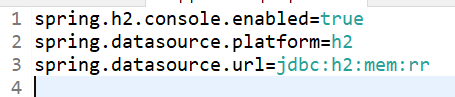

>### Steps to create application 

> <b>Create Script</b>

> 1. Create script package with following scripts

>> - RevenueRecognitionScript.java(Interface)

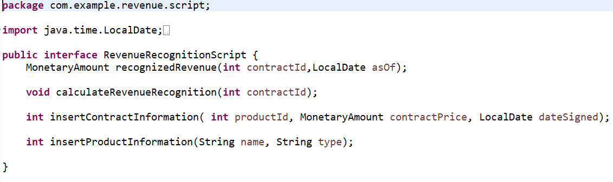

>> - RevenueRecognitionScriptImpl.java: we are using money api (e.g., Monetary)

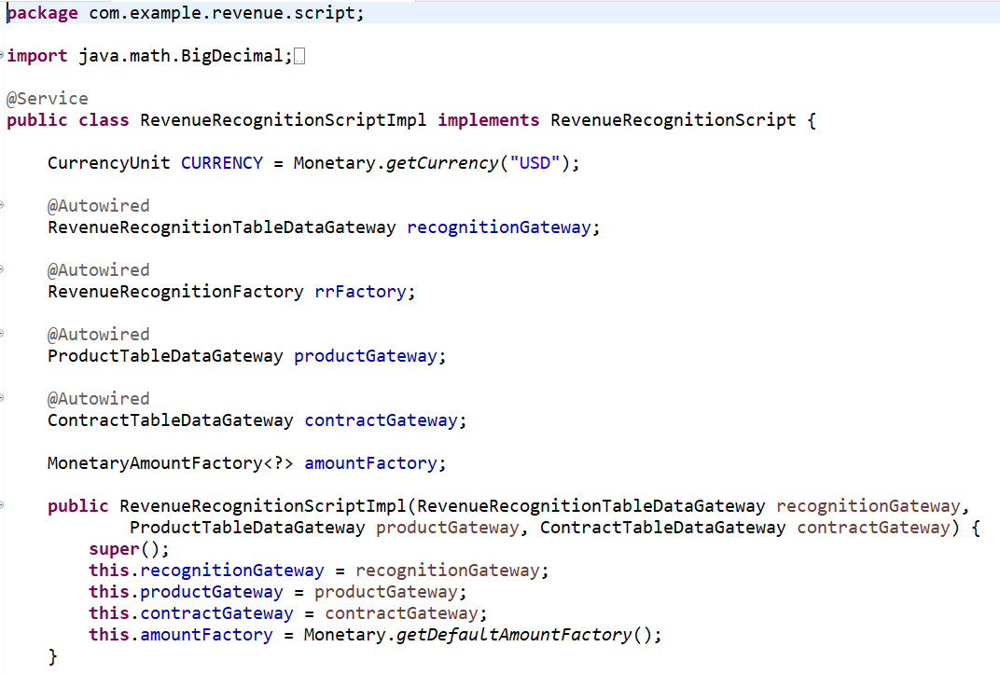

> <b>Create Data Gateways</b>

>> - AbstractTableDataGateway.java (Abstract class): DataSource which is provided by JDBC API and automatically search the database for you 

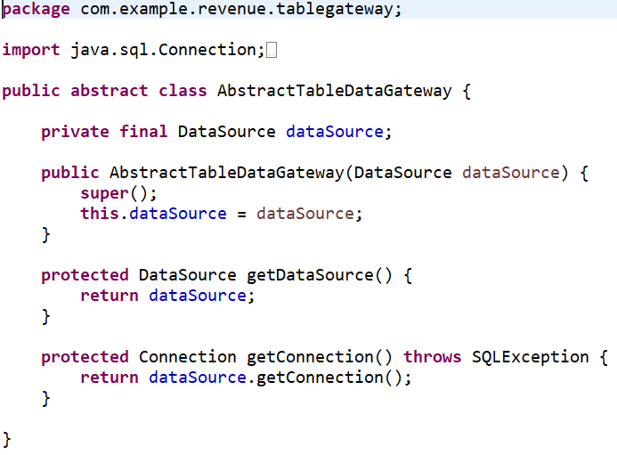

>> - ProductTableDataGateway.java

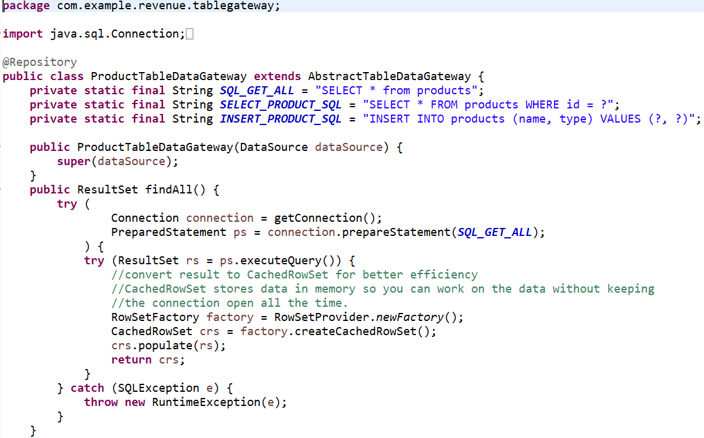

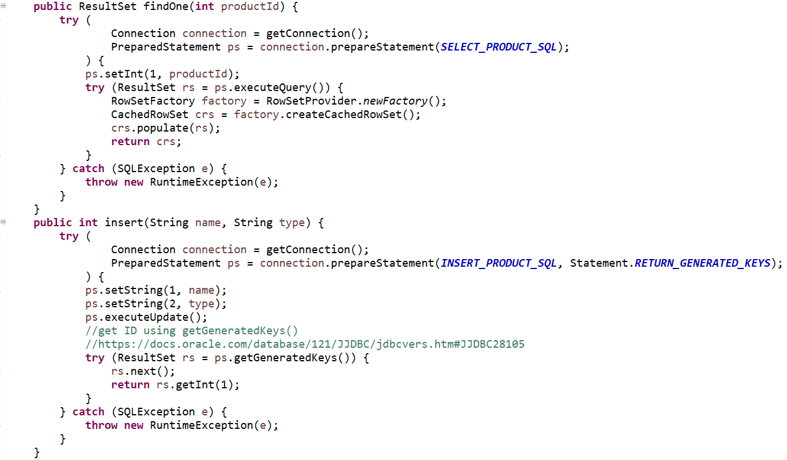

>> - ContractTableDataGateway.java

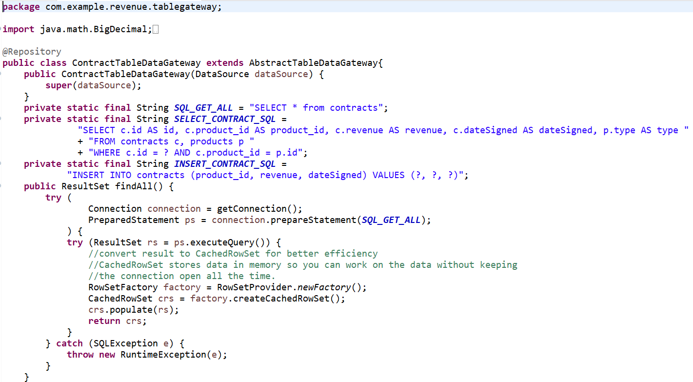

>> - RevenueRecognitionTableDataGateway.java

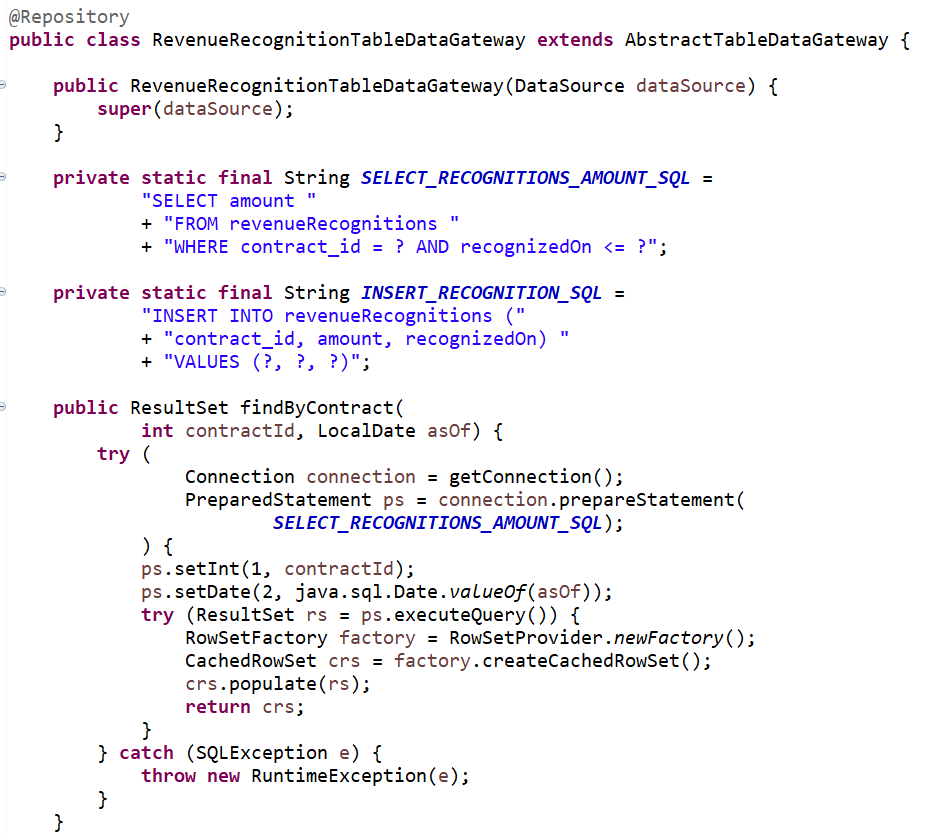

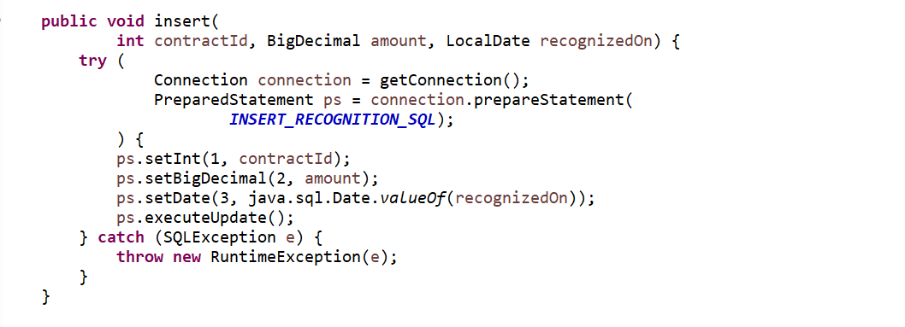

> <b>Create Helpers</b>

>> - DollarHelper.java 

> <b>Create Factory</b>

>> - RevenueRecognitionFactory.java

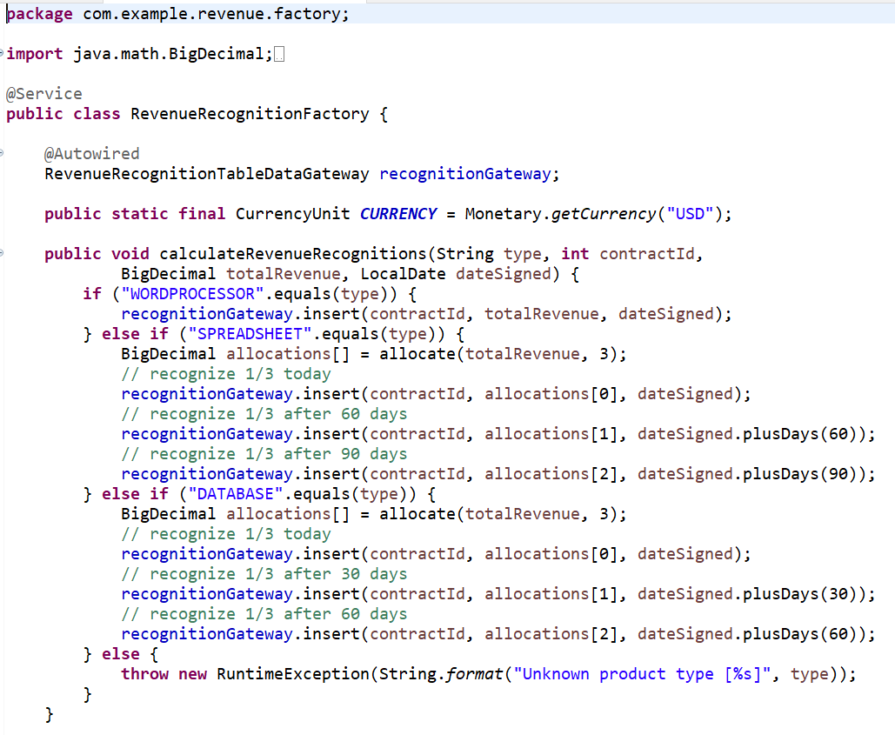

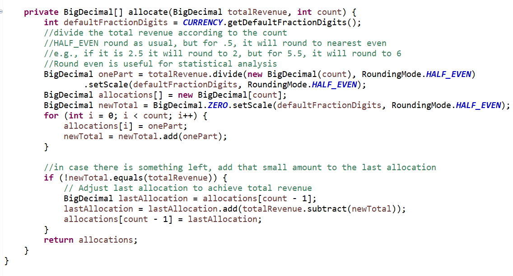

> <b>Create Controllers</b>

>> - ScriptController.java: Autowired our RevenueRecognitionScript which contains all our business logic, and our DollarHelper

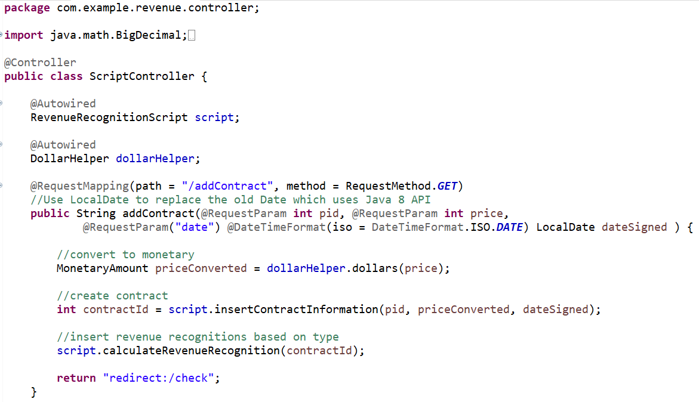

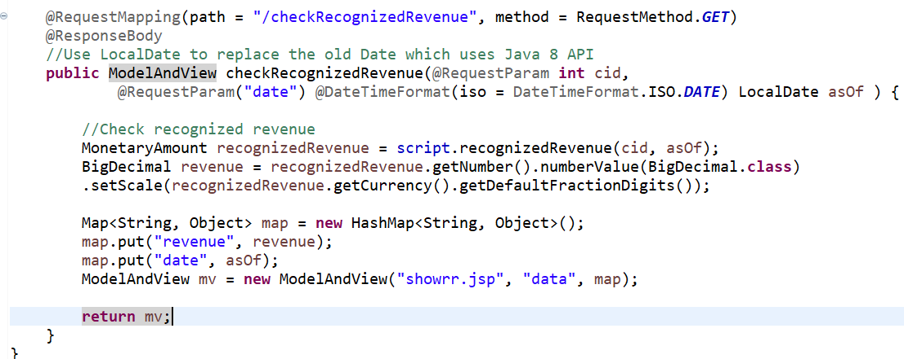

>> - HomeController.java: render the web UI for users to interact, which the UI will in turn route the request to ScriptController.java. autowiring some gateways so we can find some info to show to the web UI

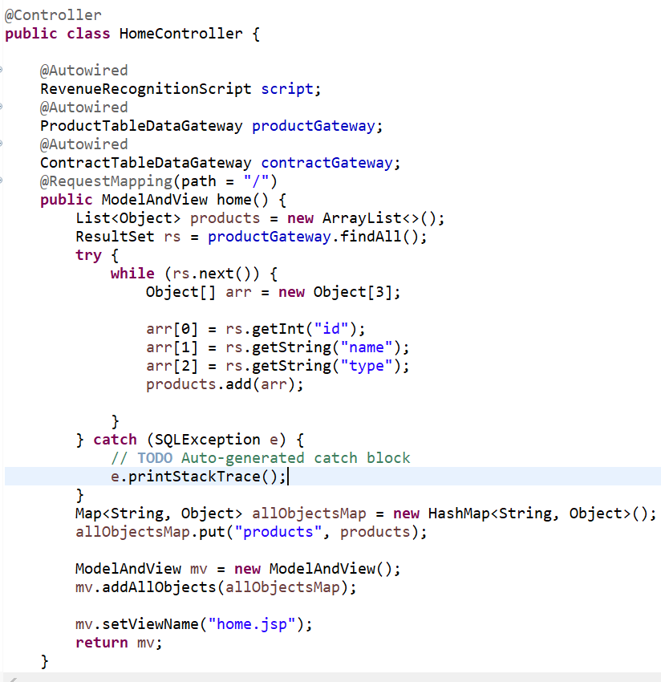

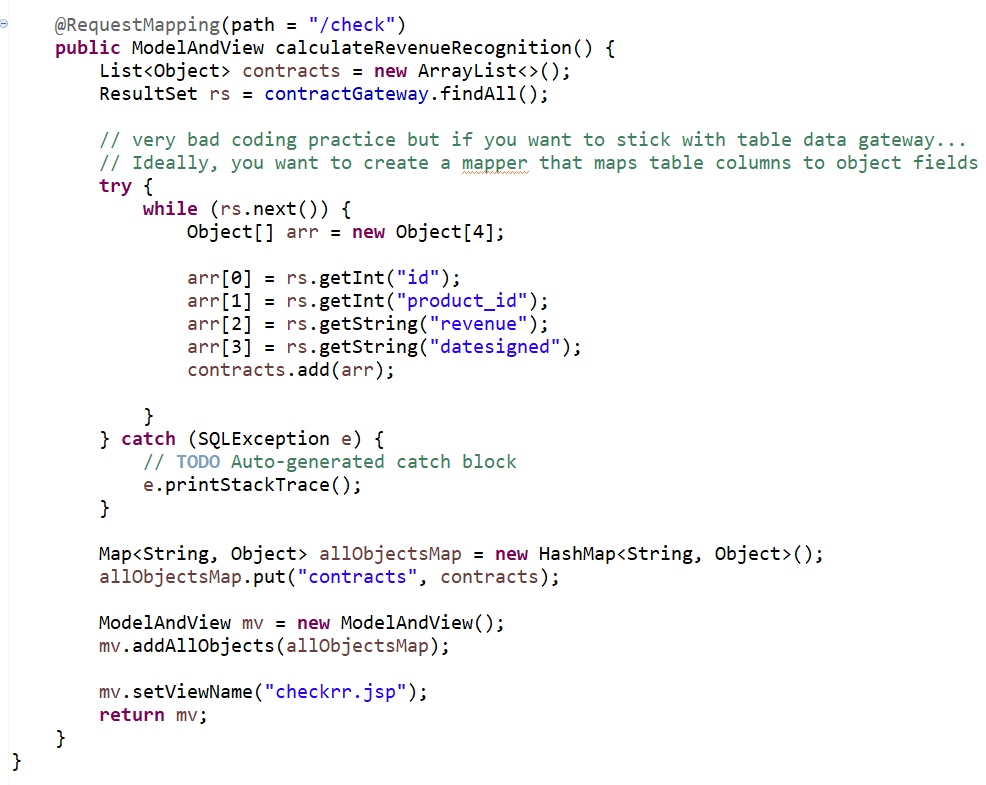

> <b>Create Views</b>

>> - Home.jsp

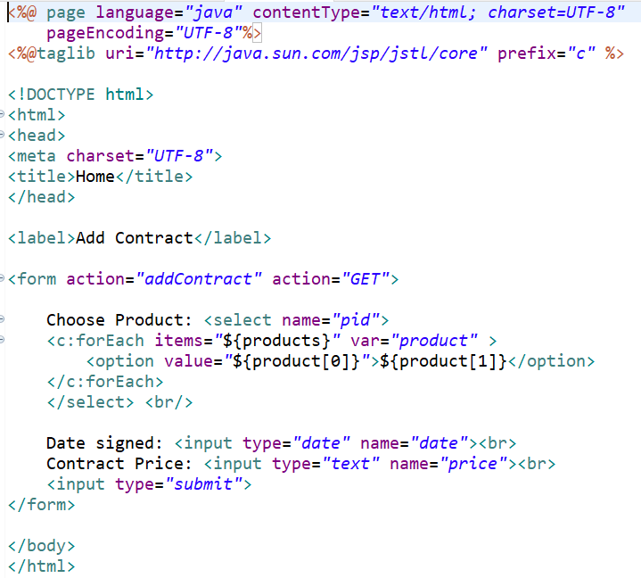

>> - checkrr.jsp

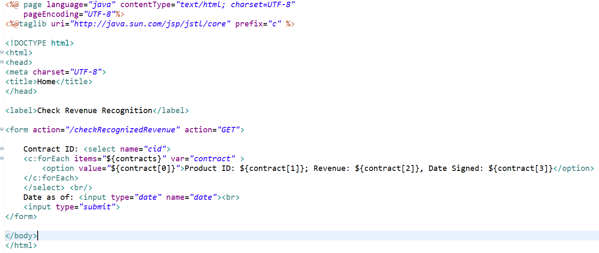

>> - showrr.jsp

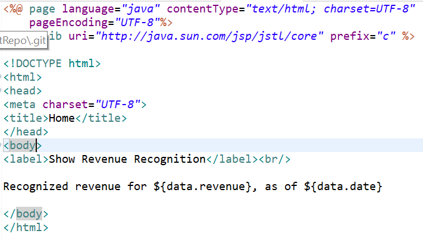

>> Add Data in data.sql

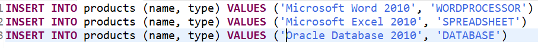

>## Output 

> - Home 

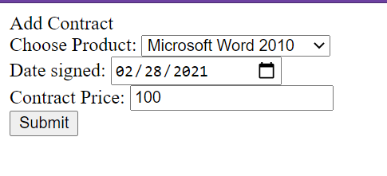

> - Check Revenue page

> - Show Revenue

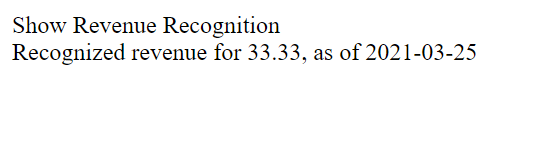
