># Multi Threading and Completable Future 

This spring boot application is for the CompletableFuture, which was introduced in Java 8, provides an easy way to write asynchronous, non-blocking and multi-threaded code.

The Future interface which was introduced in Java 5, to handle asynchronous computations. But, this interface did not have any methods to combine multiple asynchronous computations and handle all the possible errors. The CompletableFuture implements Future interface, it can combine multiple asynchronous computations, handle possible errors and offers much more capabilities.

>># Prerequisites

> Create the spring boot project with following dependencies:

1) Lombok - for reducing boilerplate code

2) JPA dependency

3) H2 - in-memory database (feel free to use others)

4) Spring Web - provides controllers and MVC support

> Add application properties for data source H2

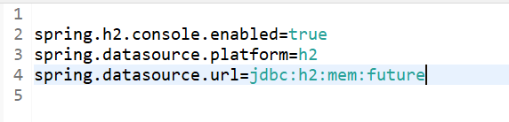

>## Steps to create application 

>## Create Model 
- Create Car.java model 

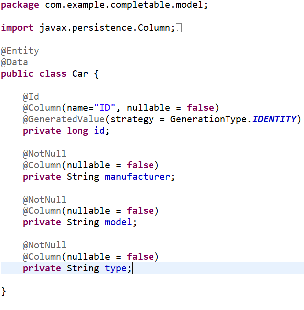

>## Create Repo 
- Create CarRepo.java interface which extends JpaRepository 

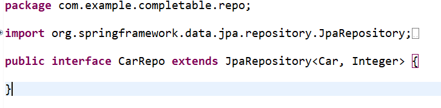

>## Create Config 
- Create  a configuration file regarding how our thread should work

- The <i>@EnableAsync</i> annotation enables Spring’s ability to run @Async methods in a background thread pool. 
- The bean <i>taskExecutor</i> helps to customize the thread executor such as configuring number of threads for an application, queue limit size and so on. Spring will specifically look for this bean when the server is started. If this bean is not defined, Spring will create SimpleAsyncTaskExecutor by default which unlimitedly spawn threads for each incoming task.
- <i>setCorePoolSize</i> set the number of threads
- <i>setMaxPoolSize</i> - When a new task is submitted, and fewer than corePoolSize threads are running, a new thread is created to handle the request, even if other worker threads are idle. If there are more than corePoolSize but less than maximumPoolSize threads running, a new thread will be created only if the queue is full. By setting corePoolSize and maximumPoolSize the same, you create a fixed-size thread pool. By setting maximumPoolSize to an essentially unbounded value such as Integer.MAX_VALUE, you allow the pool to accommodate an arbitrary number of concurrent tasks.
- <i>setQueueCapacity</i> is the number of items your threadPool will accept before rejecting them (i.e., throwing exceptions). It depends on what behavior you expect : If one task takes one second to complete, and you have 10 threads, that means that the 10,000th task in the queue will hopefully be done in 1000 seconds. Is that acceptable ? The worst thing to happen is having clients timeout and re-submit the same tasks before you could complete the firsts.

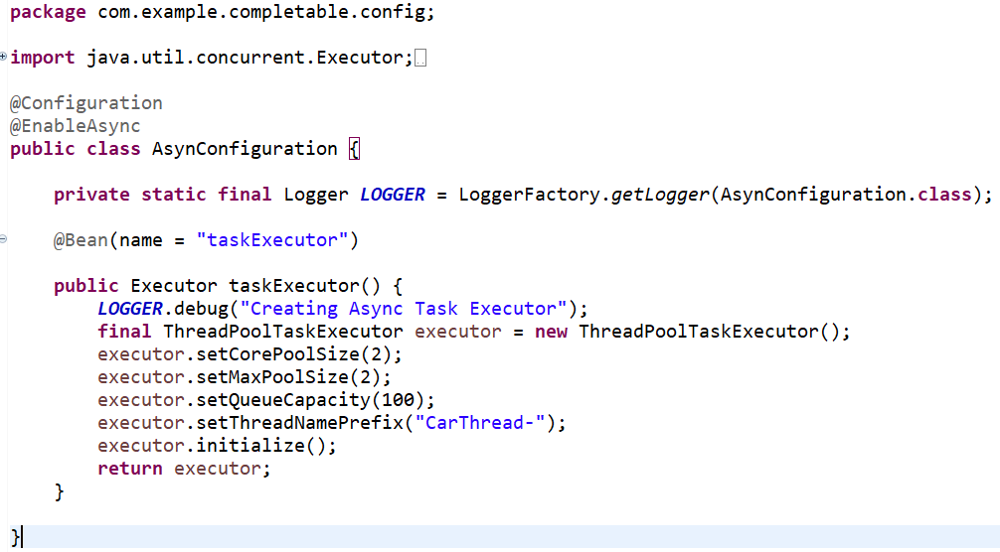

>## Create Service

- Create a service layer CarService.java that implements some async method
- We first created an <i>@Asyn</i> method to save cars.  This means that this method will run in background, and will only do the callback once it’s done, via the CompletableFuture.completedFuture, which returns a new CompletableFuture that is already completed with the given value
- Here we are accept some file as input thus we have define InputStream type as our argument
- We have also created another @Asyn method to get all cars.  To demonstrate that we only have two threads (see setCorePoolSize and setMaxPoolSize), we insert a sleep period for thread.

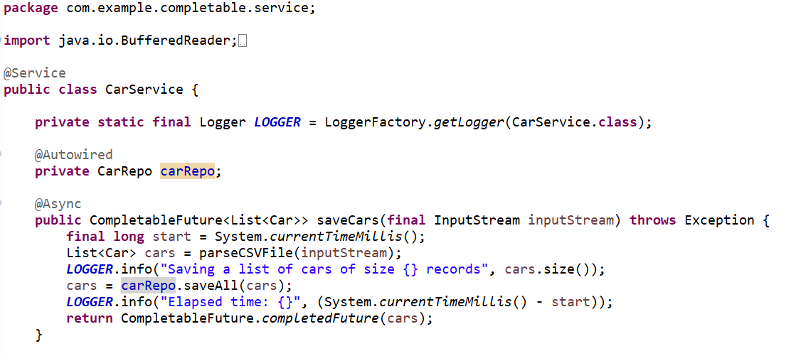

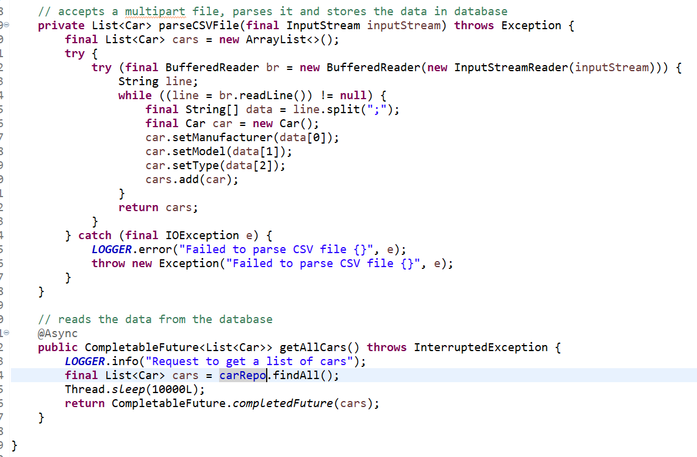

>## Create Controller

- Create controller invoke some of these services.  We will start with a POST method to invoke saving cars.
- <i>ResponseEntity</i> represents an HTTP response, including headers, body, and status which will be used to indicate success or failures in saving the files
- <i>Multipart</i> is a representation of an uploaded file in received in a HTTP multipart request
- add method for GET all the cars details
- You can attach a callback to the CompletableFuture using thenApply(), thenAccept() and thenRun() methods, for example:
- CompletableFuture.thenApply().thenAaccept.thenRun().exceptionally(throws new Exception()).build()
- You can use the thenApply() method to process and transform the result of a CompletableFuture when it arrives. It takes a Function<T,R> as an argument. Function<T,R> is a - - simple functional interface representing a function that accepts an argument of type T and produces a result of type R 
- If you don’t want to return anything from your callback function and just want to run some piece of code after the completion of the Future, then you can use thenAccept() and thenRun() methods. These methods are consumers and are often used as the last callback in the callback chain.
- CompletableFuture.thenAccept() takes a Consumer<T> and returns CompletableFuture<Void>. It has access to the result of the CompletableFuture on which it is attached.
While thenAccept() has access to the result of the CompletableFuture on which it is attached, thenRun() doesn’t even have access to the Future’s result. It takes a Runnable and returns CompletableFuture<Void> - The exceptionally() callback gives you a chance to recover from errors generated from the original Future. You can log the exception here and return a default value.
  
  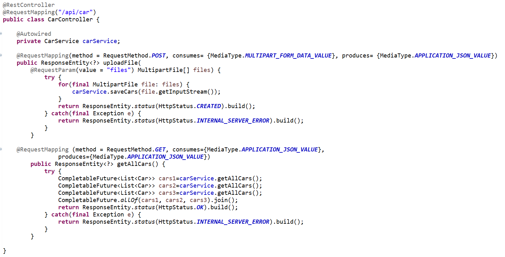

>## Output 

- Open your postman, and access the api (localhost:8080/api/car), perform a POST with three “files” along with your car.csv file(In resource folder)

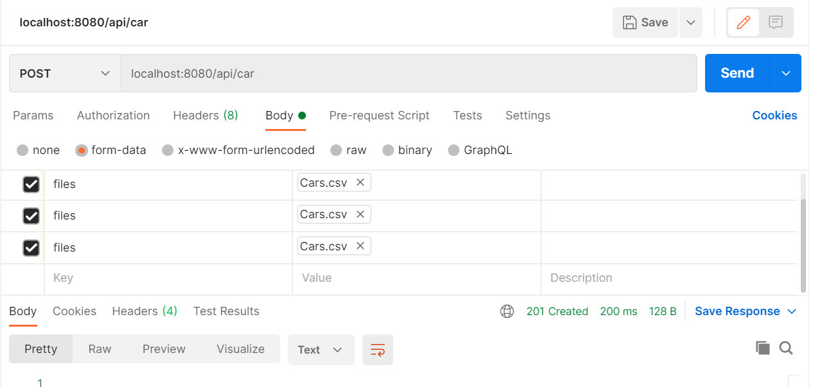

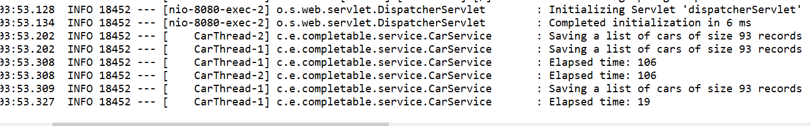

- <b>P.S. If the postman(web version) throws error as "Can’t select file at form-data, “Make sure that Postman can read files inside the working directory”."
Then set the working directory(It might not allow to set up first but, change the allow reading files from other directory from the settings)</b>

- Now to get all the car details attempt to GET request

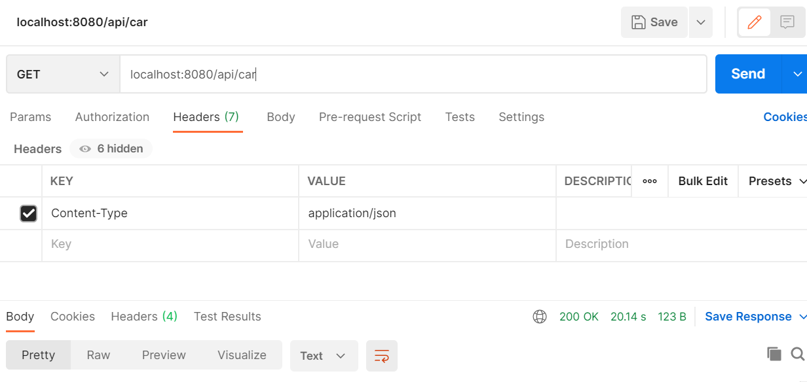

- Note the timestamps of the first two as compared to the last one.  Two thread simultaneously run but the last job has to wait until the threads are free

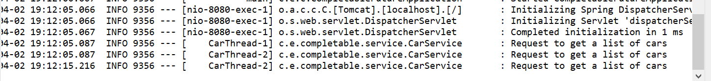

