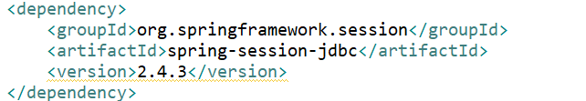
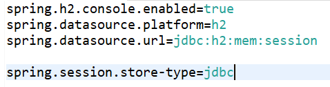
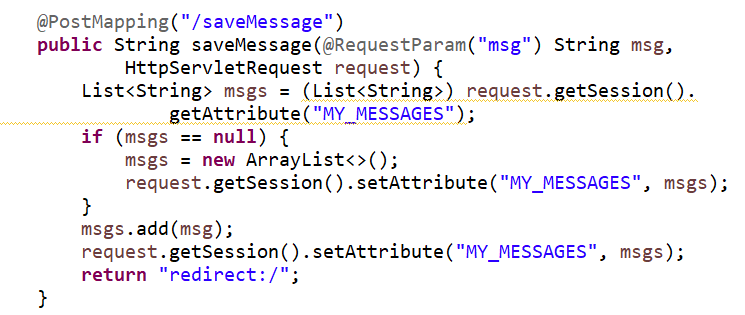
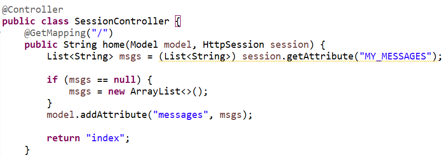
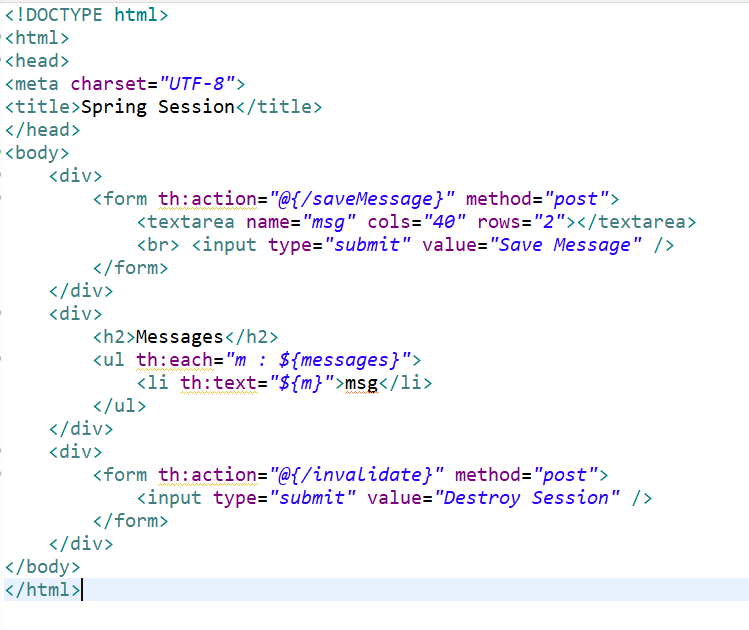
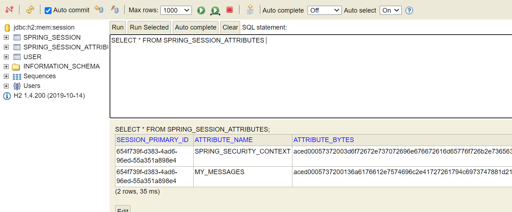
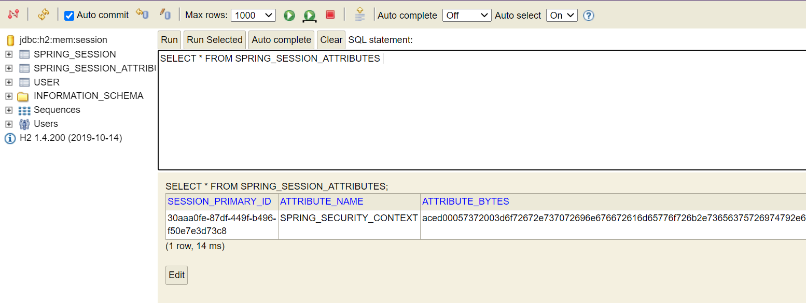

># Spring Session

- In this application using HttpSession to achieve Session management. Also, using Spring Session JDBC to store spring session information. By default Apache Tomcat stores HTTP session objects in memory.  Instead of memory, we will be using DB session state.

>># Prerequisites

> Create the spring boot project with following dependencies:

1) Lombok - for reducing boilerplate code
2) JPA - for repository pattern
3) H2 - in-memory database (feel free to use others)
4) Spring Security - provides built-in authentication-authorization
5) Thymeleaf - template engine (we have been using jsp a lot, let’s use another template engine) - html based - provides a lot of logic
6) Spring Web - provides controllers and MVC support
7) Rest Repositories - auto configure a restful apis for the model without the need of controllers
8) Spring Session - provides session support

>Add Dependency in pom.xml
There is one more dependency to include in the pom.xml which is session jdbc

> Add application properties for data source H2
  
spring.session.store-type=jdbc is added to make sure Spring Boot implements session under the hood with the datasource defined i.e. h2

>## Steps to create application 

>## Implement Spring Security

Refer the link [Spring-Security](https://github.com/shubhanginigon/HW/tree/main/Lab%202-%20Spring_Security) and follow the README to implement.

>## Spring Session

- Once the spring security is implemented, run the application and login using admin/user and open h2 console, there are two more tables.  <i>Spring Session</i> which Spring keeps all the session id variables, as well as <i>Session Attributes</i> which Spring keeps the model attributes.

- Now to manually insert session attributes into h2 database using HttpSession.setAttribute and .getAttribute, create SessionController.java
- Let’s first create a method for saving some arbitrary strings called messages
- Here we are autowiring HttpServletRequest to retrieve the session variables.  Note the difference between HttpServletRequest and HttpSession, which can both set and get session attributes.  We use HttpServletRequest to store data that is specific to a HTTP request (e.g., through restful apis); the lifetime ends when the request is finished.  - We use HttpSession when dealing with global HTTP sessions (e.g., logged-in user, user settings).  The lifetime is until the connection between client/server is closed.
- If the session attribute of MY_MESSAGES is null (i.e., first time), we initialize it.  Then we add msg to the ArrayList and refresh the page

- add a method for showing all messages by retrieving info from the session attributes using getAttribute.  Notice we use HttpSession since there is no request incoming

- Also, at Last, add method to destroy all session attributes using invalidate() method

>## Testing

- Create the <i>index.html</i> page to invoke the controller commands inside <i>'resources/templates'</i>.  @ is used to invoke any uri request. $ is used to access any variables being passed by the controllers

- Run as a Spring Boot app, and start adding some messages.  Go to h2 and notice on your session attributes table MY_MESSAGES

- After adding the messages, destroy the session and the messages stored will be removed from the table.

