># _MVC+REST using Spring Boot_
> Pre-requisites
* Download Spring boot from https://spring.io/quickstart.
* Configure Spring version 2.4.1 and Java version 11
* Install Postman: Testing tool for RESTfull calls. 

># _Steps to follow_
1) Generate Project with following dependencies: 
	1. Spring Web → dependency for making web interfaces.
	2. H2 → dependency for generating in-memory database for quick 		testing.
	3. Spring JPA → dependency for supporting many common calls to 			database without writing a bunch of SQL queries

2) Go to https://mvnrepository.com and search for tomcat jasper and jackson dataformat. Copy the dependency and paste in pom.xml file.

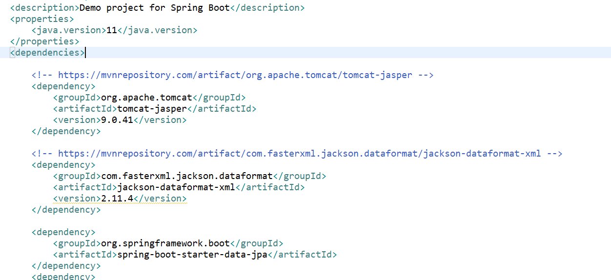

3) Inside src/main/java create package com.example.demo.model, com.example.demo.dao and com.example.demo.controller. 
	- Inside com.example.demo.model create model called user and set the 	fields uid, name and nationalit. Also create getters/setters along 	with toString.
4) Inside src/main/resources create a sql file called data.sql with insert query to add data in the user model.

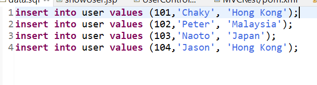

5) Inside application.properties file, add:

	spring.h2.console.enabled = true 
	spring.datasource.platform = h2
	spring.datasource.url = jdbc:h2:mem:mydb
	-here 'jdbc:h2:mem' will not change but 'mydb' is the name and can be 	anything

6) Now you can access the db through http://localhost:8080/h2-console  
enter spring.datasource.url and click connect.

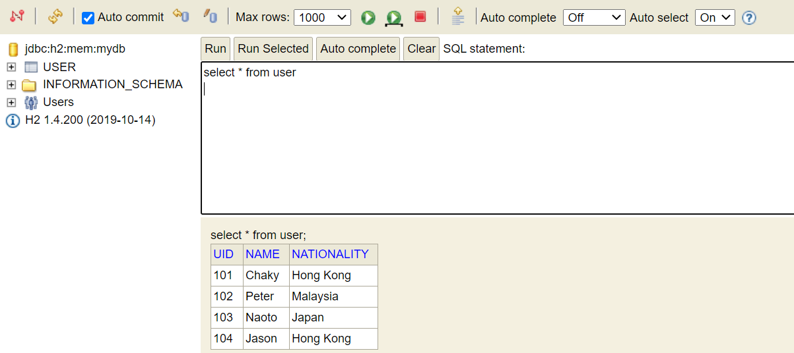

7) Inside your src/main, create a folder called webapp and inside that create
home.jsp and showUser.jsp with following code

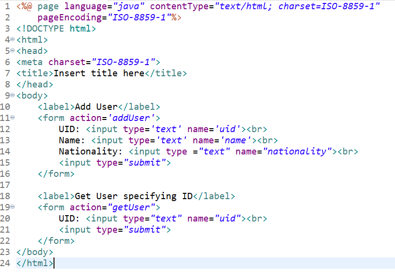
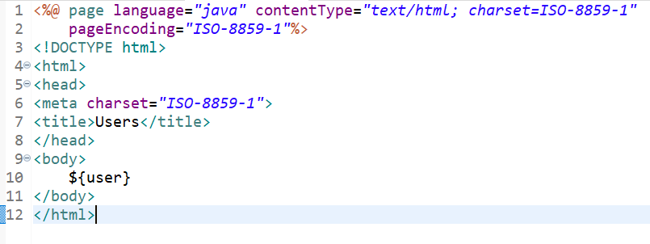

8) Inside  src/main/java in controller  package, create a class UserController.java add following code to create function home() to access jsp.By returning home.jsp, it will automatically searched in the src/main/webapp folder

9) Inside  src/main/java in dao package, create a interface UserDao.java
which extends CrudRepository <User, Integer>

Also in dao package, create a class UserJPADao.java which extends JpaRepository <User, Integer>

10) Inside UserController.java 
Create two dao, one of UserDao type, and another of UserJPADao type.  Both of them should have annotation of @Autowired

11) Create the following methods in UserController.java
	- public String addUser(User user)
  
	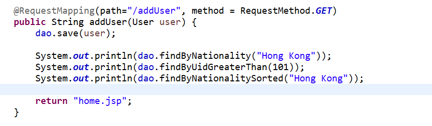

	- public ModelAndVIew getUser() 
    	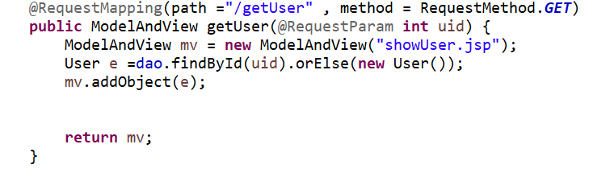

12) add RESTFul APIs and use postman to test
	- public String getUsersREST()
    	
	
	- public String getUsersRESTJPA()
    	

	- public String getUserREST() 
    	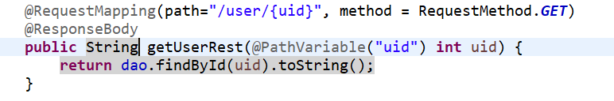

	- public String getUserRESTJPA() 
    	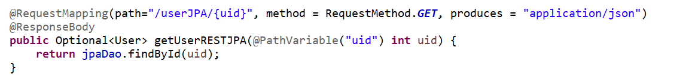

	- public User postUser()
 	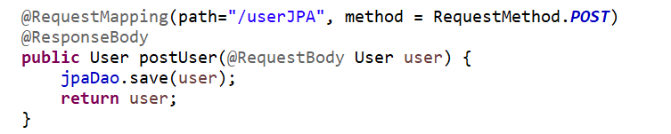

	- public String saveOrUpdateEmployee()
  	 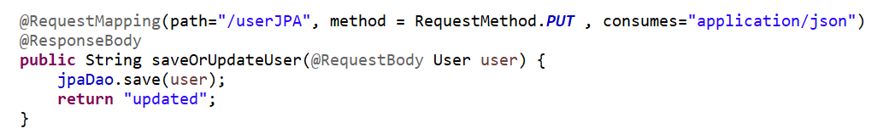

	- public String deleteUser()
  	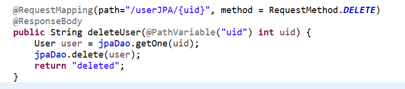
