># Design Patterns 

Design patterns are an essential part of software development. These solutions not only solve recurring problems but also help developers understand the design of a framework by recognizing common patterns.

**Prerequisites**
- Create spring boot project from the spring boot starter pack with following dependencies 
	- H2 
	- Spring web
	- JPA 
	- Lombok
- Add the other dependency such as tomcat-jasper, jasper dataformat and lombok in pom.xml from [Maven Repository](https://mvnrepository.com/)

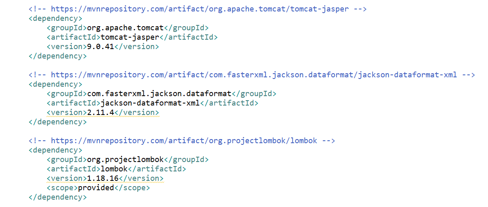

### Following are the 6 design pattern implemented in this project
** 1. Builder**
 	- Use builder when a long list of attributes have to be maintained. In this project @builder annotation is used to generate builder function and constructor for user.

	
   Now to demonstrate, create BuilderController.java with function getUser() and use User.builder() which is created automatically by lombok
   
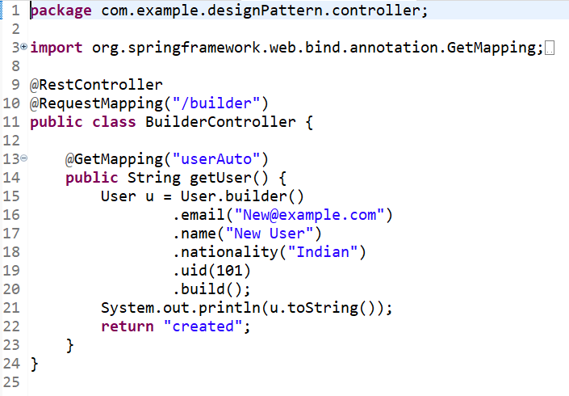

   Test from postman if the user is created when
   

 	
** 2. Factory** 
	- When creation logic is complex and difficult to maintain then, create a interface that will handles all the creation in one place, and let the client calls that interface. That's Factory pattern. Here factory pattern is used for different roles of users. 
	

	
   create some concrete role Admin.java and Member.java

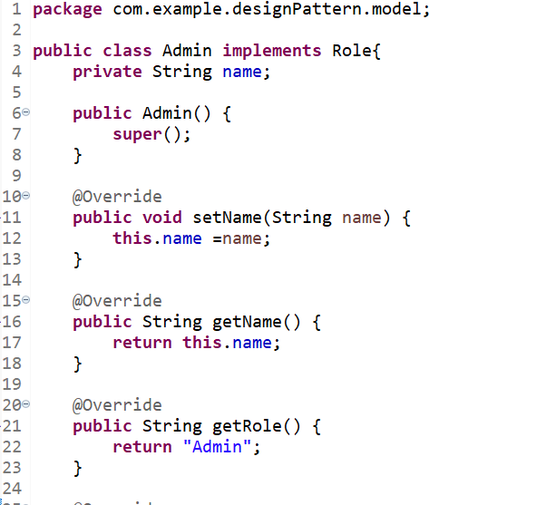

   Now create roleFactory.java and controller for the same
 

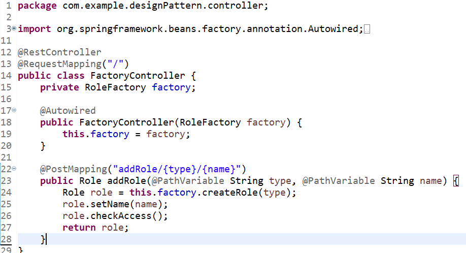

   Test the factory pattern implementation using postman 

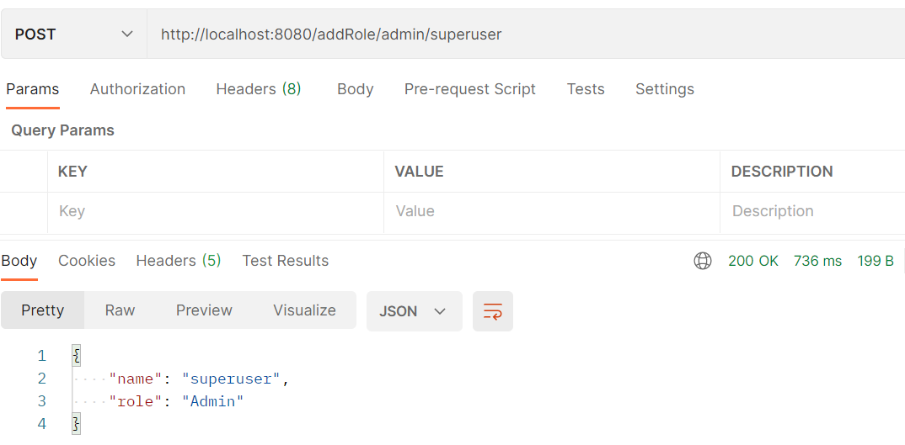

** 3. Adapter**
	- Adapter allows two unrelated/uncommon interfaces to work together, without changing their existing code.
Then use a single class (the adapter class) to join functionalities of independent or incompatible interfaces/classes.
	Inside package adapter, create the two interfaces, LineFormattable.java and CsvFormattable.java

 

   Then create two concrete classes NewLineFormatter.java and CsvFormatter.java that implements the interfaces

 

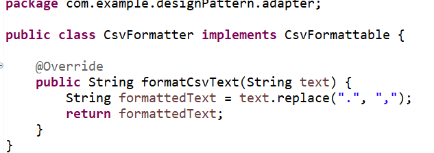

   Create CsvAdapterImpl.java with the following code

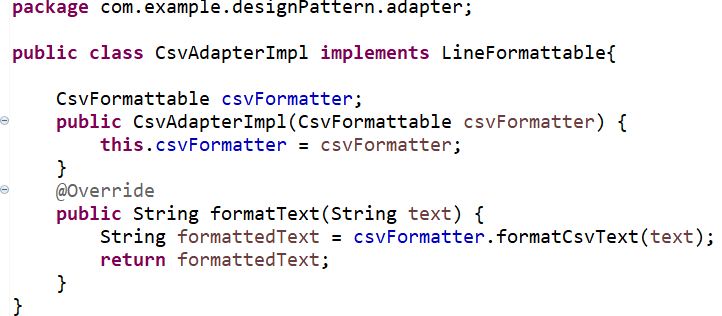

   To demonstrate, under your Main program, try this following code
   
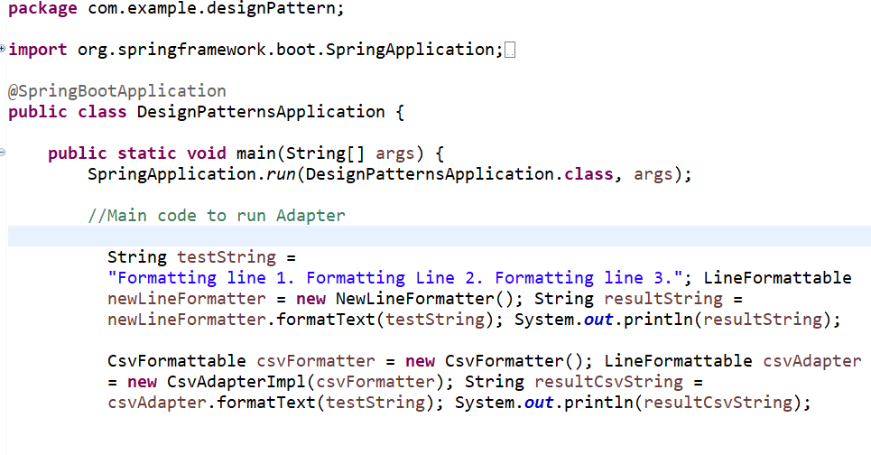

 

** 4. Proxy**
	- Proxy is that surrogate object can implement additional logic without complicating the real object, for example, here, let’s implement some access logic into our CommandAccess object and create the concrete class CommandAccessImpl.java
	

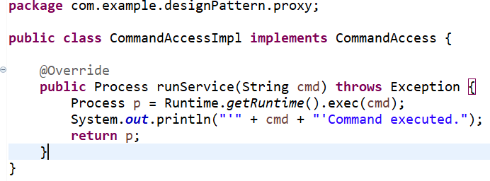

   Now, create the proxy CommandAccessProxy.java, which we have added some access logic

   
   the proxy on our Main program ProxyMain.java
   
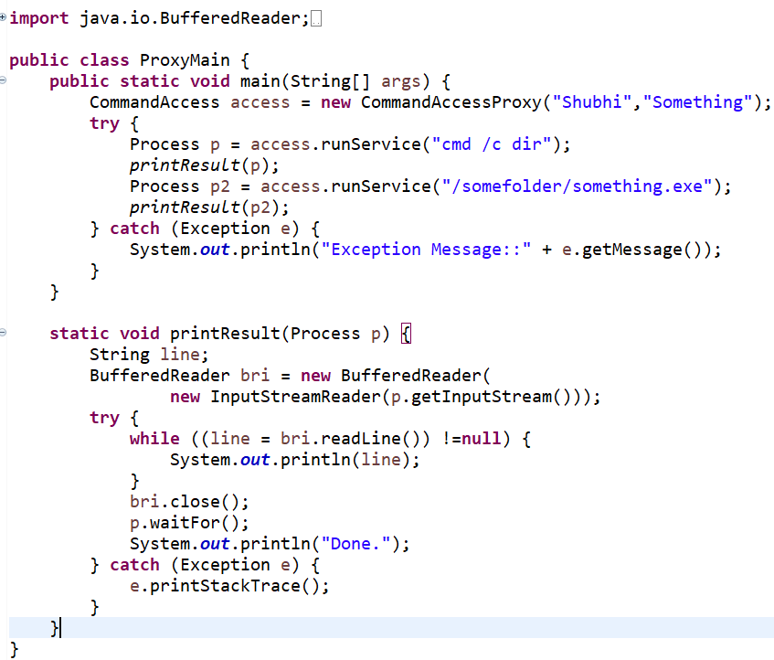   

** 5. Decorator** 
	- Decorator can be useful for adding features without over using inheritance. First, create an abstract class of Character.java inside decorator model 

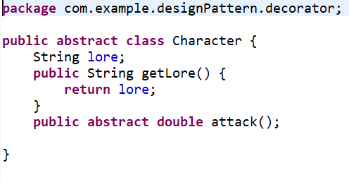

   now create Swordman.java extending the Character class

   create an  abstract class for CharacterDecorator.java
   
 

   Now create Weapon.java for CharacterDecorator, to use as a decorator for swordman
 
  

   To test this write the code in main class as follows, and check the console for output 

 

 

** 6. State**
	- State pattern is useful when maintaining an entity contains multiple transitions between states
 First, create an interface State.java to impose the rule
 

create concrete class Swordman.java that implement this interface.

  
 
 run the main program Main.java to demonstrate state changes

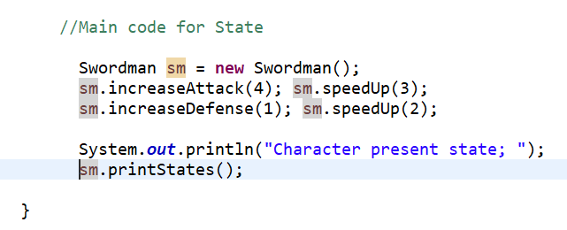 

 
