># Spring Security

**Prerequisite**
1. Create spring boot project from the spring boot starter pack with following dependencies:

- Lombok - for reducing boilerplate code
- Java Mail Sender - simple api for sending email
- JPA - our lovely Object Relational Mapping (ORM) mapping tool
- H2 - in-memory database (feel free to use others)
- Spring Security - provides built-in authentication/authorization
- Spring Web - provides controllers and MVC support
- Rest Repositories - provides automatic restful controllers
- Validation - provides table validation such as @Email

2. Add the other dependency such as tomcat-jasper, jasper dataformat and JSTL in pom.xml from [Maven Repository](https://mvnrepository.com/)

**Add SMTP properties in application.properties**
1. Setup a inbox for smtp properties, here I used [Mailtrap](http://mailtrap.io)

2. Enter the smtp details obtained from the inbox created.

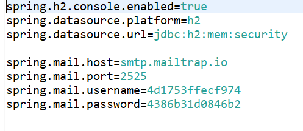

**Add Models**
1. Create domain model - User.java and Role.java which have a many-to-many relationship.  In such a case, if we use @ManyToMany, JPA will automatically create an intermediate table in between. 

2. In User.java use following annotations:
	
 
 - *@Id* - specifies what is primary key
 - *@Getters and @Setters* - lombok automatically handles for us
 - *@GeneratedValue* tells JPA that it is auto-increment 
 - *@NotBlank* - informs the validation rule.  “message” is the error message that will be displayed in the view
 - *@Transient* - tells JPA not to create this field in the table, but only for internal logic purpose
 - *@Email*- comes from validation dependency, validating email
 - *@ManyToMany* will create an intermediate table. FetchType.EAGER specifies that when users are created, it will also fetch the roles,  The opposite is FetchType.LAZY.  If we use Spring Security, we have to use FetchType.EAGER.  Given that roles are of small size, eager fetching is ok.
 - *@JsonBackReference* specifies the child of the bidirectional relationship.  Without specifying this, there will be “Infinite Recursion Error”. 
- Set is more efficient for handling many to many association, but otherwise, use List
 

3. Create Role.java with @mappedBy for mapping the roles to user

- *@mappedBy* = “roles” - The word “roles” refer to the object in the User.java.  mappedby tells JPA that it is already mapped, otherwise, you will get duplicate tables.  Another is whether to put on which side of the bidirectional relationship is not important as it only affects the naming of the table, but we usually put on the non-owning (child) side, here is the role side.
- Also using @JoinTable we can specify the exact name you like, as well as the column name.

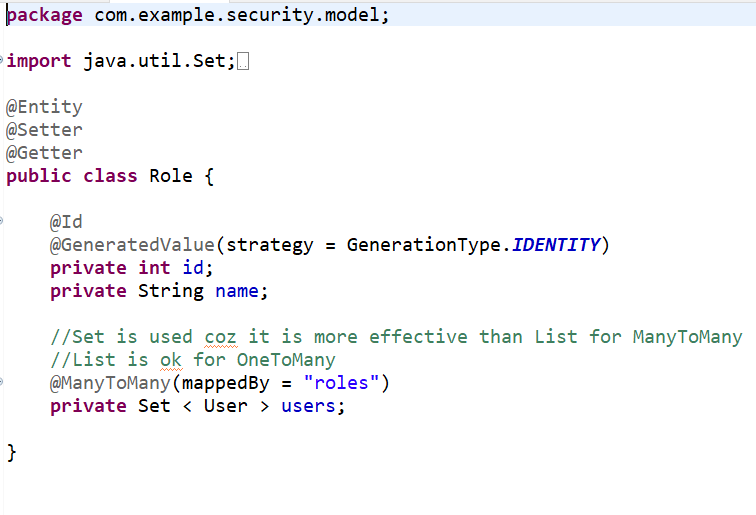

**Adding DAO**
1. As we have two classes User.java and Role.java hence, we need two DAO UserJPADao.java and RoleJPADao.java

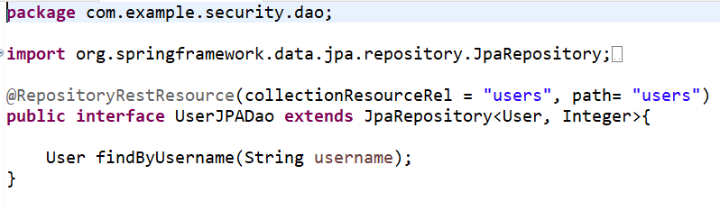

2. Add insert into queries in data.sql for role model 

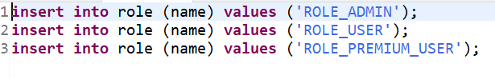

**Spring Security**
1. Create SecurityConfig.java extends WebSecurityConfigurerAdapter - this is the main file controlling authentication and authorization logic, as well as general configuration including password encoders

- We use BCryptPasswordEncoder().  By adding @Bean, it allows other classes to use it as @Autowired.  The difference between @Bean and @Component is that @Bean is method level while @Component is class level.

 2. MyUserDetailsService is a UserDetailsService interface implementation which provides service access to user details

3. UserDetailsImpl.java - this contains concrete implementation of how the users will be created with authorities and will feed the user back to MyUserDetailsService.java

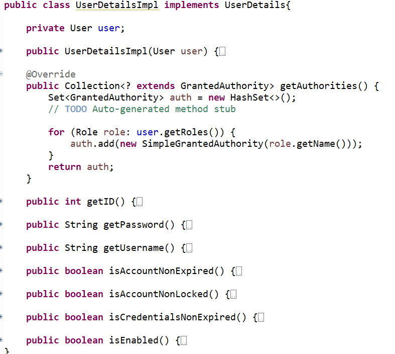

**Adding UserService**
1. UserService.java - simply an interface defining user services

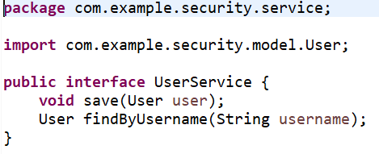

2. UserServiceImpl.java - a service helper to give us utility function related to users
Notice that we have @EmailService that notify users of successful registration.
Also note that before we save, we encode our password using our autowired bcrypt password encoder.

**Adding EmailService**
1. Create the interface EmailService.java

2.Here is the concrete implementation - EmailServiceImpl.java
${spring} variable ties to application.properties

**Adding custom validation and error messages**
1. UserValidator.java - we have implemented @NotBlank in the User.java, this will provide with customized validations.  This can be done by implementing Validator.

2. Create a configuration file CustomMessageSourceConfiguration.java that specify “messages” as the file holding error messages, which refers to messages.properties.
@Configuration - make sure this file will be run as configuration at runtime

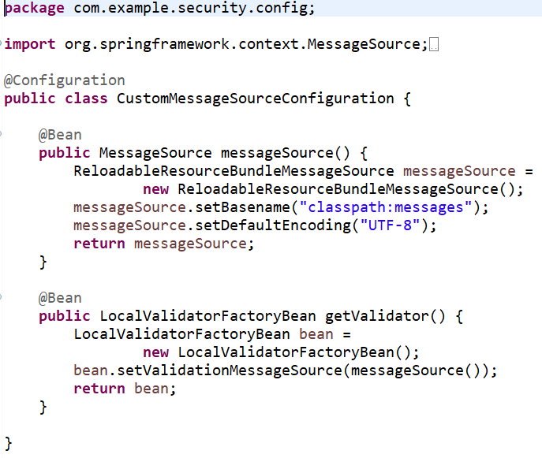

3. Add messages in messages.properties

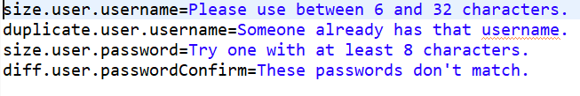

**Add Controller**
1. Create UserController.java 

- Principal class can retrieve who is the one currently logged in
@Valid will tell Spring boot to apply validator to the attribute
Model model as argument provides extra model information to the view.  Very similar to ModelAndView
@ModelAttribute specifies that certain attribute belongs to a model
BindingResult is the object holding the errors after validations
Since we create our own Validator, we have to inform the BindingResult as specified in the clause userValidator.validate...

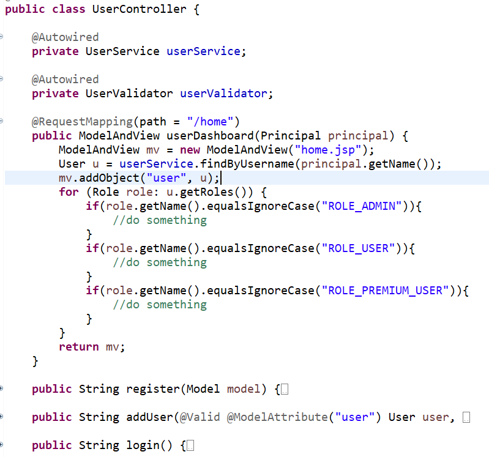

**Add Views**

1. Create views for home.jsp, Login.jsp, Logout.jsp and Register.jsp 

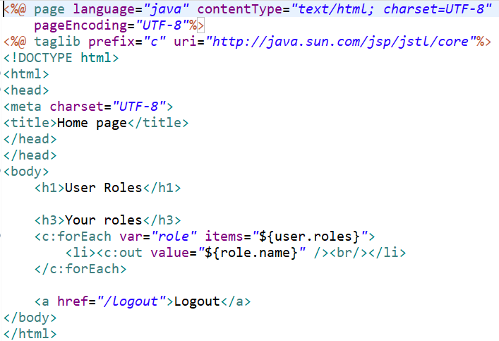

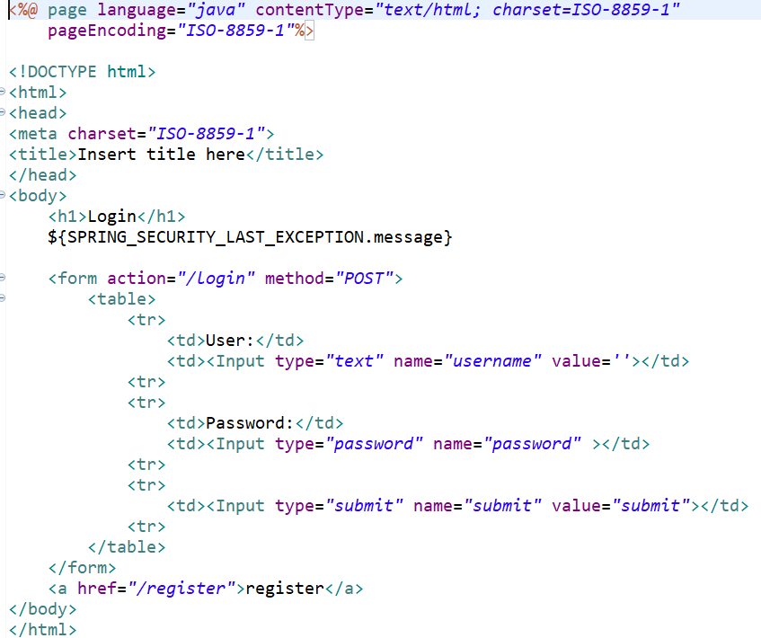

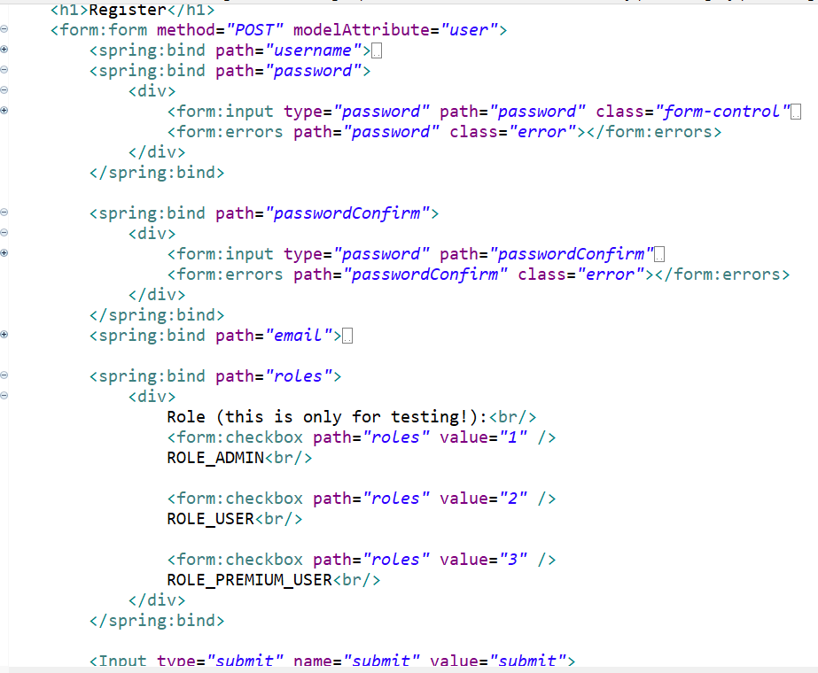
