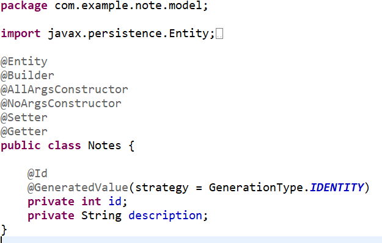
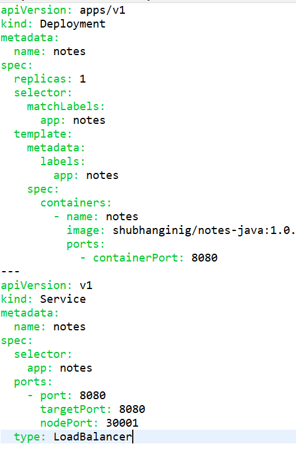

># Microservices and Kubernetes

In this lab we have developed an app using Spring Boot to take notes and save it, after that deploy it as a container in Kubernetes.

## Prerequisites
Create the spring boot starter project with the following dependencies: 

- Lombok - for reducing boilerplate code
- H2 - in-memory database
- Spring Web - provides controllers and MVC support
- Actuator - provide health endpoints for our application. For example, the health endpoint provides basic application health information.
- Thymeleaf - templating engine for HTMLs.  Better than JSP in all aspects as it doesn't mix logic.  Works well with javascript frameworks like Angular.  Another promising templating engine is Mustache which is even simpler!
- Spring data JPA

## Steps are as follows:

Setup the application.properties for the datasource 

>> 

Create the Models 

- Create entity in model Notes.java

>> 

Create Repo 

- Create repository interface NoteRepo.java

>> 

Create Controllers 

- create controller NotesController.java which has method to retrieve all notes, method for saving notes, route for invoking the get and save method.
- In method getAllNotes(Model model) the reverse method is for showing the most recent one first

>> 
>> 

Create Views

- As we are using thymeleaf, the view index.html will be created inside resource/templates/

>> 

Make Executable JAR file 

- Before we will containerize our app, let’s make a jar file so it can be containerized. 
- Select “Run as Maven Build”, and put the goal as “package” and click run. “package” here means it will take the compiled code and package it in its distributable format, such as a JAR.  
- It will take some time, but the jar file will be inside the target folder.

>> 

Create Docker Container 

- First Install Docker for windows 10 
- In my case, I have windows 10 Home and it doesn't have Hyper-V feature for that I followed following guide to [install Hyper-V in win 10 Home](https://www.itechtics.com/enable-hyper-v-windows-10-home/)
- After that install docker desktop for windows from [Docker Hub](https://hub.docker.com/)
- As soon as the installation is completed, I got this error 

>> 

- Go to the mentioned link in the error [kernel update package](https://docs.microsoft.com/en-us/windows/wsl/install-win10#step-4---download-the-linux-kernel-update-package)
- Install the Linux kernel update package
- Now start the docker desktop 

- After it's started run the command in CMD <i>docker run hello-world</i> to check if docker is working 

>> 

- To run docker, we need a Dockerfle.  Go to the root of your app, create the Dockerfile (same level as pom.xml and without any extension).

>> 

- In Docker File: 
  - FROM defines the base layer for the container, in this case, a version of OpenJDK 11
  - WORKDIR sets the working directory to /opt/. Every subsequent instruction runs from within that folder
  - ENV is used to set an environment variable
  - COPY copies the jar files from the /target/ into the /opt/ directory inside the container. mention target/{your JAR filename.JAR}
  - ENTRYPOINT executes java $JAVA_OPTS -jar app.jar inside the container
 
- To run the file, traverse to your directory where the Dockerfile is. Run the following command: <i> docker build -t note-java . </i><b><<Don’t forget the dot! >></b>
  - -t note-java defines the name ("tag") of your container 
  - — in this case, my container is just called notes-java
  - . is the location of the Dockerfile and application code — in this case, it's the current directory
  
-Type docker images to list all docker images.  You should see the note-java image that you just built.    You can also see hello-world which is automatically downloaded when you first do docker run hello-world

>> 

- To run the docker image, run command <i> docker run --name=note-java -p 8080:8080 note-java </i>    Note the following about this command:
--name defines the name for the container
-p 8080:8080 publishes port 8080 of the container to port 8080 of your local machine. That means, if you now access port 8080 on your computer, the request is forwarded to port 8080 of the note container. You can use the forwarding to access the app from your local machine

- Output for the Docker 

>> 

Push app to Docker repository 

- Create DockerID from Docker hub and run command <i> docker login </i>
- Images uploaded to Docker Hub must have a name of the form username/image:tag:
    - username is your Docker ID
    - image is the name of the image
    - tag is an optional additional attribute — often it is used to indicate the version of the image
- Rename the image with command <i>docker tag notes-java <username>/notes-java:1.0.0</i>

>> 

-Now upload the image to Docker hub <i>docker push <username>/notes-java:1.0.0 </i>

>> 

- go to the docker hub website 

>> 

-  let’s stop the previous one that we have deployed.  Even it is Exited, but since we have run, it remains in the registry. Run command <i> docker ps -a </i>
- let’s make sure we stop everything
    <i>docker stop notes-java</i>  //stopping the image
    <i>docker rm notes-java</i> //removing it from the registry
    
>> 

- verify the docker hub connection with the image works,  <i>docker run --name=notes-java -p 8080:8080 <username>/notes-java:1.0.0 </i>

Deploying to Kubernetes

- Minikube creates a single-node Kubernetes cluster running in a virtual machine.   A Minikube cluster is mostly intended for testing purposes (you may want to use Amazon Elastic Kubernetes or Google Kubernetes Service for production).  Before we install Minikube, we have to [install kubectl](https://kubernetes.io/docs/tasks/tools/install-kubectl/)
- After installation check the version by <i>kubectl version --client</i>

>> 

- After kubectl is installed, [install Minikube](https://minikube.sigs.k8s.io/docs/start/)  
- After installation run <i>minikube start --driver=docker</i> to start minikube

>> 

- create a folder named kube in your application directory.  The purpose of this folder is to hold all the Kubernetes YAML files that we will create.  The first Kubernetes resource is a Deployment.  Here is the definition of the Deployment file
kube/note.yaml

>> 

- The first four lines define the type of resource (Deployment), the version of this resource type (apps/v1), and the name of this specific resource (note).  Next, we have the desired number of replicas.   We don't usually talk using the term  “containers” in Kubernetes, instead we talk using the term “Pods”.  A Pod is a wrapper around one or more containers.  Most often, a Pod contains only a single container — however, for advanced use cases, a Pod may contain multiple containers.  If a Pod contains multiple containers, they are treated by Kubernetes as a unit — for example, they are started and stopped together and executed on the same node.  A Pod is the smallest unit of deployment in Kubernetes — you never work with containers directly, but with Pods that wrap containers.
 
- The second part is the Service resource.  It defines the available service accessible from outside the cluster.  The first part is the selector according to their labels - this should correspond exactly to what we specified in our Deployment resource template/metadata>labels>app which is note.

- Check if Minikube cluster is running by command <i> minikube status</i>

>> 

- If the not running, do <i>minikube start</i>
- apply the resource definition with the following command  <i>kubectl apply -f kube</i>   The command submits all the YAML files in the kube directory to Kubernetes, and will create Pods.  Check that the pods are created successfully by <i>kubectl get pods</i>

>> 

- Also check <i>kubectl get svc</i> for svc services

>> 

- Launch app, run <i>minikube service notes </i>

>> 

