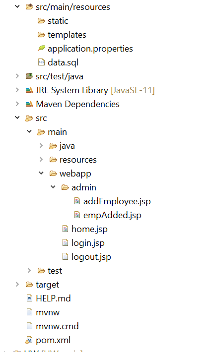

># SAD Midterm 2021

 ## Tried to create a webapp to manage the employee in emp user model 
 
 Added following dependencies 
 
- Lombok - for reducing boilerplate code
- JPA - for repository pattern
- H2 - in-memory database (feel free to use others)
- Security - for providing authentication-authorization
- Spring Web - provides controllers and MVC support
- Rest Repo - provides restful controllers 

Aside from these dependencies, install these additional dependencies from [maven repositories](https://mvnrepository.com/)

- Tomcat jasper - for working with jsp file
- Jackson xml - in case you would like to work with xml file
- JSTL - a jsp tagging library for looping, conditional logic
- Money-api and moneta - for working with currency file

Created Models, Controllers, and views as shown below:

